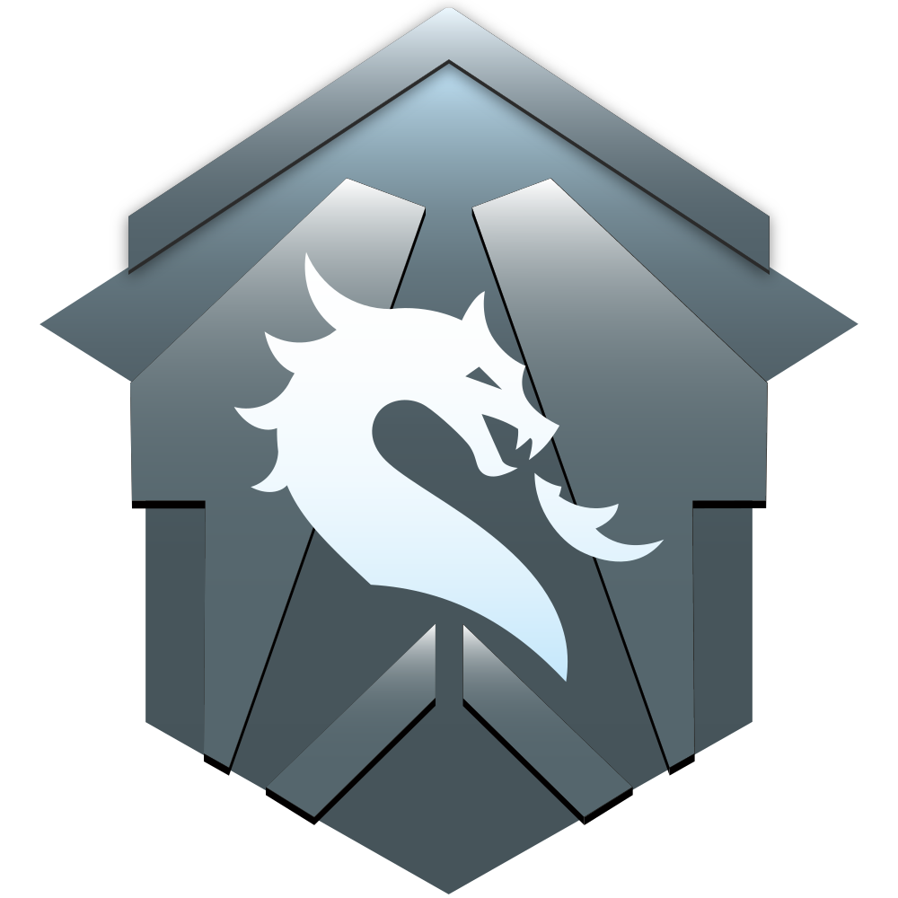

<p align="center">
  
</p>

<h1 align="center">Draconis</h1>

<p align="center">
  A native macOS launcher for <strong>Titanfall 2 + <a href="https://northstar.tf">Northstar</a></strong>, built with SwiftUI and the Liquid Glass design system.
</p>

<p align="center">
  
  
  
  
</p>

---

Draconis is **not** a Wine front-end of its own — it is a polished native launcher that drives an existing Wine layer underneath. If you already have a CrossOver bottle with Titanfall 2 + Northstar installed, **Draconis detects it automatically and just launches the game**.

| Backend | Status | Bottle creation |
|---|---|---|
| CrossOver | Preferred | Use CrossOver UI |
| Apple Game Porting Toolkit 2 | Recommended | Managed by Draconis |
| Kegworks (Wineskin successor) | Supported | Use Kegworks UI |
| Whisky (discontinued) | Read-only | — |

## Features

- **One-click launch** of Northstar or vanilla Titanfall 2 from any detected bottle
- **Backend auto-detection** for CrossOver, GPTK, Kegworks, and Whisky
- **Northstar updater** that downloads releases from [`R2Northstar/Northstar`](https://github.com/R2Northstar/Northstar) and applies them in-place
- **Thunderstore mod browser** with install / enable / disable / uninstall support
- **Server browser** backed by the Northstar masterserver
- **Steam auto-install** into the active prefix when Titanfall 2 is missing
- **Liquid Glass UI** — uses macOS Tahoe's native `.glassEffect()` rather than faking blur with `.ultraThinMaterial`

## Requirements

- macOS Tahoe (26) or later
- Xcode 26 or later
- A wine/translation layer (CrossOver, GPTK, or Kegworks)
- A legal copy of Titanfall 2 (Steam, Origin, or EA App)

## Building

```bash
# Generate Draconis.xcodeproj and open in Xcode
./bootstrap.sh --open

# Or build from the command line
xcodebuild -project Draconis.xcodeproj \
           -scheme Draconis \
           -configuration Release \
           -derivedDataPath build
```

The build output is `build/Build/Products/Release/Draconis.app`.

See [BUILD.md](./BUILD.md) for the full build, signing, and notarisation walkthrough.

## How CrossOver detection works

On launch, Draconis scans for CrossOver bottles and looks for Titanfall 2 in the following paths inside each bottle:

```
~/Library/Application Support/CrossOver/Bottles/<bottle>/
    drive_c/Program Files (x86)/Origin Games/Titanfall2/
    drive_c/Program Files (x86)/Steam/steamapps/common/Titanfall2/
    drive_c/Program Files/EA Games/Titanfall2/
```

A bottle is marked **Northstar-ready** when `NorthstarLauncher.exe` sits next to `Titanfall2.exe`. Draconis invokes wine directly — no Apple Events, no scripting of the CrossOver UI.

## Project layout

```
Draconis/
├── App/            DraconisApp.swift, AppEnvironment.swift
├── Models/         WineBackend, NorthstarInstall, Mod, Server
├── Services/       CrossOverDetector, WineBackendManager, NorthstarLauncher,
│                   NorthstarUpdater, ThunderstoreClient, ServerBrowserClient,
│                   SteamInstaller, ProcessRunner, PathResolver
├── Views/          ContentView, PlayView, ModsView, ServersView,
│                   SettingsView, OnboardingView, Components/
└── Resources/      Info.plist, Draconis.entitlements, Assets.xcassets
```

## Contributors

<table>
  <tr>
    <td align="center">
      <a href="https://github.com/AA-EION">
        <br />
        <sub><b>EION</b></sub>
      </a>
    </td>
  </tr>
</table>

## Credits

- The Northstar team at [R2Northstar](https://github.com/R2Northstar)
- [Viper](https://github.com/0neGal/viper) by 0neGal — the original launcher that inspired Draconis
- Apple's Game Porting Toolkit team
- The Kegworks / former Wineskin maintainers

## License

GPL-3.0-or-later. Draconis is a derivative work in spirit — but not in code — of the Viper launcher, which carries the same licence.
